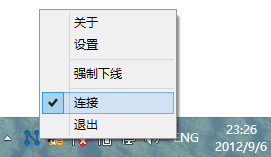
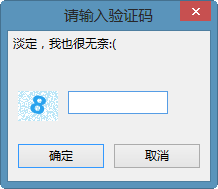
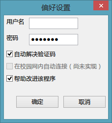
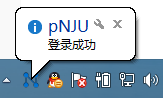
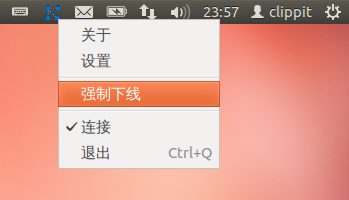

# Release Your Power of *p.nju.edu.cn*!

## 它是干什么用的？

亲们有没有觉得每次想上网的时候都要打开浏览器，进入`http://p.nju.edu.cn`，然后输入用户名、密码、验证码，再点“登录”的过程十分繁琐吗？于是这个小程序就应运而生了！它会安静地躺在你的任务栏通知区域里，帮你完成上网和下线的操作。

如果你打开程序以后发现什么都没有发生，请务必找到这个小图标哦。

## 如何使用？

很简单哦，先进入设置，填好用户名和密码。当不在线时，点选“连接”即可登录；当在线时，“连接”前会出现对勾，再次点选即为注销。当然，至于验证码嘛……

## 每次输入验证码太麻烦了，可以跳过吗？

当然可以！不过由于此功能还在试验中，所以可能导致登录过程缓慢。想要开启，请在设置页面中勾选“自动解决验证码”的选项。

如果看到这个信息，就代表成功了！

## “强制下线”功能是干什么用的？

普通帐号最多只能在一台设备（电脑、手机等）中登录。当发生“您的登录数已达最大并发登录数”的错误时，说明你的帐号已经在别处登录。此时除了在登录的设备上进行注销操作外，还可以用任意设备手动到[http://bras.nju.edu.cn](http://bras.nju.edu.cn)进行强制下线操作，此后才能正常连接。这个功能便是简化了该操作，实现了一键强制下线的功能。

## “帮助改进该程序”是干什么的？难道会收集我的密码？

p-NJU承诺保障用户的帐号安全，绝不会偷偷收集用户的密码，即便在保存用户密码的配置文件中也避免了明文储存密码。就目前来说，这个选项并没有什么实际作用，在将来的更新中可能会用于改善程序逻辑和检测校园网的功能。

## 我不用Windows，就不能使用它了吗？
就当前版本来说，是的:( 不过事实上Linux和Mac OS X的版本已经可以使用，不过需要进一步测试，并完善打包部署的工作。如果你希望帮助实现它们，请不要犹豫联系我们。附上Ubuntu下的本程序谍照：

## 程序出现问题了，该找谁？

如果发生问题，可能有两种原因：`p.nju.edu.cn`系统的问题或者是本程序的问题。如果你不确定问题所在，可以先向本项目报告。你可以在小百合BBS的Software版或Network版发帖求助，或者联系项目维护者[{{ site.author }}](https://github.com/{{ site.author }}) 。

## 我可以协助改进这个工具吗？
强烈欢迎！你可以在本页上找到[项目主页]({{ site.project_page }})，那里有进一步说明。
